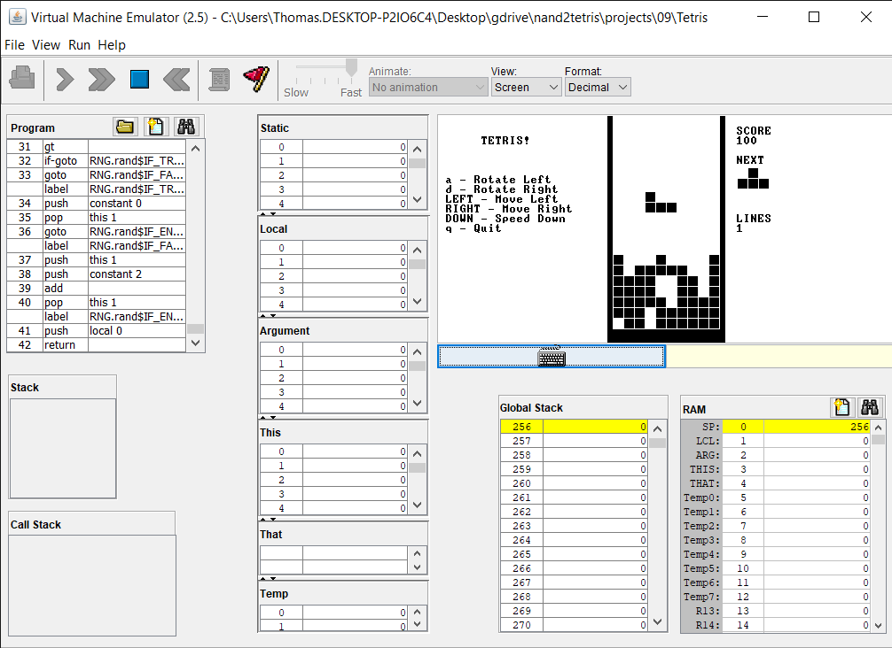

# nand2tetris
Coursework for nand2tetris parts 1 and 2 on Coursera

Course descriptions from Coursera - 

Part 1 - 

In this project-centered course you will build a modern computer system, from the ground up. We’ll divide this fascinating journey into six hands-on projects that will take you from constructing elementary logic gates all the way through creating a fully functioning general purpose computer. In the process, you will learn - in the most direct and constructive way - how computers work, and how they are designed.

Part 2 - 

In this project-centered course you will build a modern software hierarchy, designed to enable the translation and execution of object-based, high-level languages on a bare-bone computer hardware platform. In particular, you will implement a virtual machine and a compiler for a simple, Java-like programming language, and you will develop a basic operating system that closes gaps between the high-level language and the underlying hardware platform. In the process, you will gain a deep, hands-on understanding of numerous topics in applied computer science, e.g. stack processing, parsing, code generation, and classical algorithms and data structures for memory management, vector graphics, input-output handling, and various other topics that lie at the very core of every modern computer system.

End result - 

Certificates -

https://www.coursera.org/account/accomplishments/certificate/4M9D4UVJJCZS

https://www.coursera.org/account/accomplishments/certificate/7BFYEZBU3KWY
